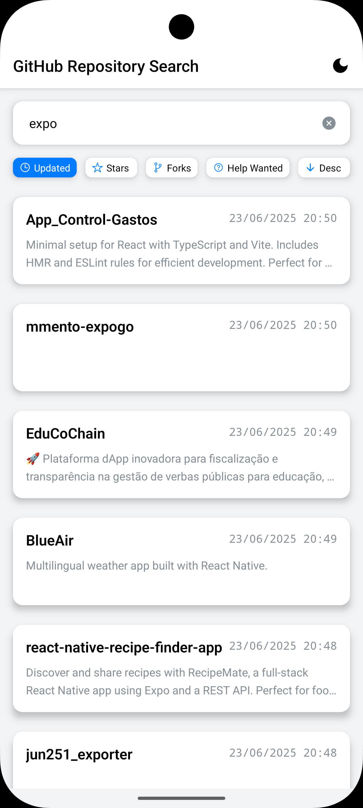
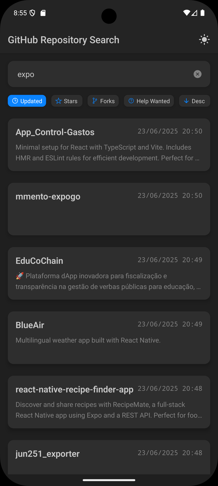
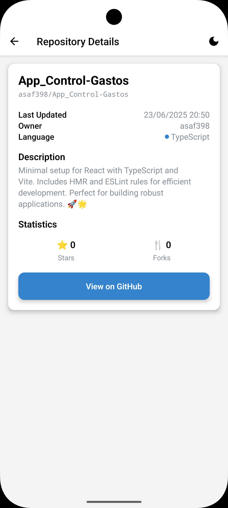
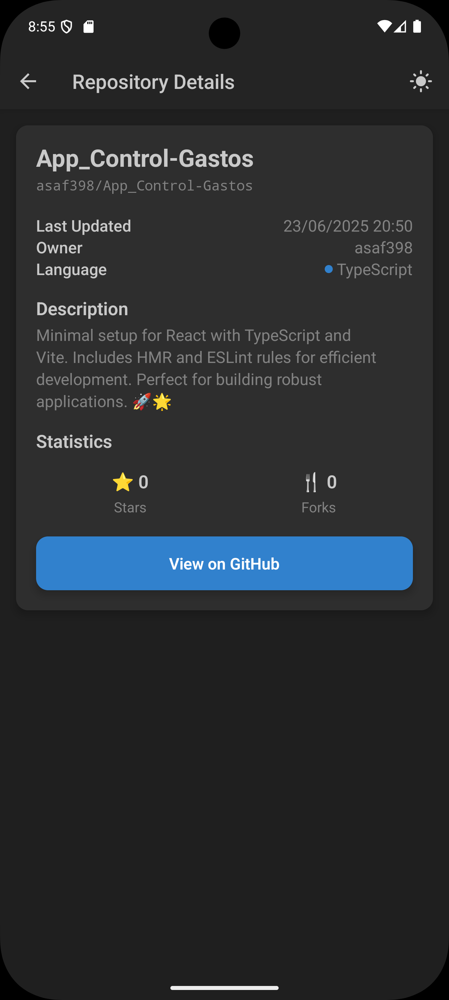
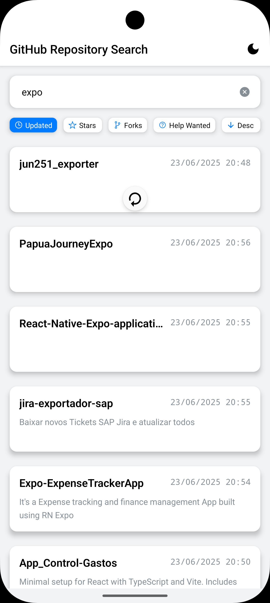
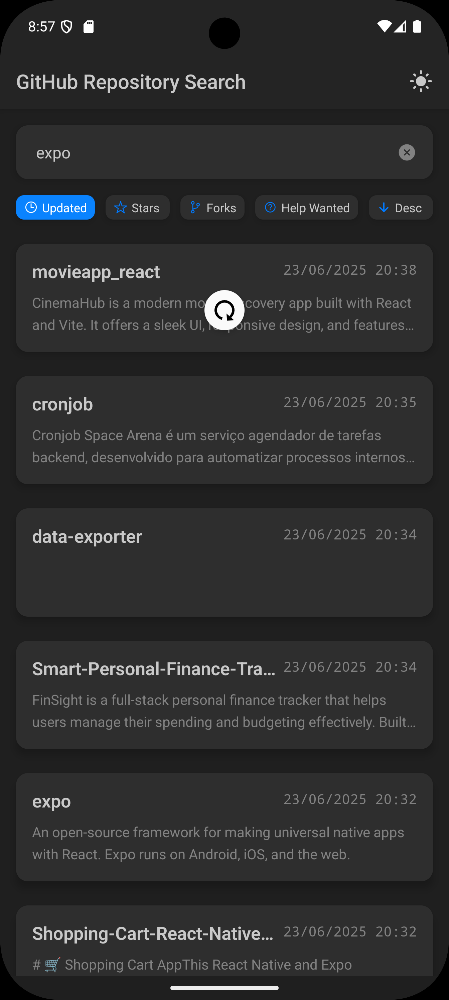

# 📱 GitHub Repository Search Mobile App

[](https://github.com/your-org/rn-github-repository-search)
[](https://expo.dev/)
[](https://www.typescriptlang.org/)
[](LICENSE)

A **fast, polished React Native mobile app** for discovering and exploring GitHub repositories. This project was crafted to demonstrate technical expertise and meet challenge requirements as part of an **[Interview Task](docs/INTERVIEW-TASK.md)**. Built with modern tools including **Expo**, **TypeScript**, **Redux Toolkit**, and **RTK Query** for optimal performance and developer experience.

## 📖 Table of Contents

- [Demo](#-demo)
- [Core Features](#-core-features)
- [Documentation](#-documentation)
- [Tech Stack](#-tech-stack)
- [Getting Started](#-getting-started)
- [Development Workflow](#-development-workflow)
- [API Integration](#-api-integration)
- [Roadmap](#-roadmap)

## 📚 Documentation

- 📝 **[Interview Task](docs/INTERVIEW-TASK.md)** - Challenge requirements & implementation
- 🏗️ **[Architecture Overview](docs/ARCHITECTURE.md)** - Project structure and patterns
- 📱 **[Development Setup](docs/DEVCONTAINER.md)** - DevContainer configuration
- 📋 **[API Reference](docs/API.md)** - Detailed API integration guide
- 🔍 **[Search & Pagination](docs/PAGINATION-FILTERING.md)** - Search implementation details

## 🎨 Demo

_Experience the app in both light and dark themes with smooth navigation and real-time search._

<div align="center">

|                                                              Search Interface                                                              |                                                               Repository Details                                                               |                                                                          Pull to Refresh                                                                           |
| :----------------------------------------------------------------------------------------------------------------------------------------: | :--------------------------------------------------------------------------------------------------------------------------------------------: | :----------------------------------------------------------------------------------------------------------------------------------------------------------------: |
| <br> | <br> | <br> |
|                                                   _Instant search with debounced input_                                                    |                                                     _Comprehensive repository information_                                                     |                                                                _Smooth refresh with loading states_                                                                |

</div>

## 🚀 Core Features

### 🔍 **Smart Search**

- **Debounced Input**: Optimized API calls with 300ms delay
- **Real-time Results**: Live updates as you type
- **Advanced Sorting**: By stars, forks, or last update

### 📱 **Mobile Experience**

- **Infinite Scroll**: Seamless pagination with 20 items per page
- **Pull-to-Refresh**: Quick data updates with haptic feedback
- **Responsive Design**: Optimized for all screen sizes
- **Gesture Navigation**: Smooth transitions between screens

### 🎨 **User Interface**

- **Theme Support**: Light/Dark mode with system preference detection
- **High Contrast**: Accessibility-optimized color schemes
- **Error Handling**: Graceful error states with retry options
- **Loading States**: Skeleton loaders and progress indicators

### 🛠 **Developer Features**

- **Mock API**: Offline development without GitHub rate limits
- **Type Safety**: Full TypeScript coverage
- **State Management**: Redux Toolkit with RTK Query caching
- **Hot Reload**: Fast development iteration

## 🛠 Tech Stack

### Core Framework

- **[React Native](https://reactnative.dev/)** `0.79.4` - Cross-platform mobile development
- **[Expo](https://expo.dev/)** `~53.0.11` - Development platform and build tools
- **[TypeScript](https://www.typescriptlang.org/)** `5.1+` - Type safety and better DX

### State Management

- **[Redux Toolkit](https://redux-toolkit.js.org/)** `^2.8.2` - Predictable state container
- **[RTK Query](https://redux-toolkit.js.org/rtk-query/overview)** - Data fetching and caching

### Navigation & UI

- **[Expo Router](https://expo.github.io/router/)** `~5.1.0` - File-based navigation
- **[React Native Reanimated](https://docs.swmansion.com/react-native-reanimated/)** - Smooth animations
- **[Expo Image](https://docs.expo.dev/versions/latest/sdk/image/)** - Optimized image component

### Development Tools

- **[ESLint](https://eslint.org/)** & **[Prettier](https://prettier.io/)** - Code quality and formatting
- **[Jest](https://jestjs.io/)** - Unit testing framework
- **[EAS Build](https://docs.expo.dev/build/introduction/)** - Cloud build service

## 📦 Getting Started

### Prerequisites

- **Node.js** `18.x` or newer
- **pnpm** `8.x` or newer (recommended) or npm/yarn
- **Expo CLI** (install with `npm install -g @expo/cli`)
- **Android Studio** (for Android development)
- **Xcode** (for iOS development on macOS)

### Installation

1. **Clone the repository**

   ```bash
   git clone https://github.com/your-org/rn-github-repository-search.git
   cd rn-github-repository-search
   ```

2. **Install dependencies**

   ```bash
   pnpm install
   ```

3. **Set up environment** (optional)

   ```bash
   # Create .env.local file for API tokens and authentication
   # GitHub token (to avoid API rate limits)
   # GitHub and Expo tokens
   echo "EXPO_PUBLIC_GITHUB_TOKEN=your_github_token_here
   EXPO_PUBLIC_GITHUB_TOKEN=your_expo_token_here" > .env.local
   ```

### Quick Start Options

| Command        | Description           | Use Case                 |
| -------------- | --------------------- | ------------------------ |
| `pnpm dev`     | Start with dev client | Native development       |
| `pnpm web`     | Start web version     | Quick preview            |
| `pnpm android` | Run on Android        | Device/emulator testing  |
| `pnpm ios`     | Run on iOS            | Device/simulator testing |

## 🔧 Development Workflow

#### Local Development

1. **Prebuild native code** (when configuration changes):

   ```bash
   pnpm expo prebuild --clean
   ```

2. **Start Metro bundler** with Dev Client:

   ```bash
   pnpm dev
   ```

3. **Run on target platform**:

   ```bash
   # Android (requires Android Studio/emulator)
   pnpm android

   # iOS (requires Xcode/simulator on macOS)
   pnpm ios

   # Web (for quick testing, limited native features)
   pnpm web
   ```

#### Testing & Quality

```bash
# Run tests in watch mode
pnpm test

# Lint code
pnpm lint

# Type checking
npx tsc --noEmit
```

### 📱 Build & Distribution

The app uses **EAS Build** for cloud-based builds. See [`eas.json`](./eas.json) for build profiles.

> **Note:** EAS builds require authentication. You can either:
>
> - Add `EXPO_TOKEN=your_token_here` to `.env.local` for automated authentication
> - Run `eas login` manually before building
>
> See [DevContainer Setup](docs/DEVCONTAINER.md) for more details.

#### Development Builds

```bash
# Android development build (with dev client)
pnpm eas:build:android:dev       # Remote build
pnpm eas:build:android:dev:local # Local build

# iOS development build
pnpm eas:build:ios:dev
```

#### Release Builds

```bash
# Preview builds (internal testing)
eas build --profile preview --platform android
eas build --profile preview --platform ios

# Production builds (app stores)
eas build --profile production --platform android
eas build --profile production --platform ios
```

## 🔌 API Integration

### GitHub Search API

The app integrates with the [GitHub Search API](https://docs.github.com/en/rest/search) to fetch repository data:

- **Endpoint**: `GET /search/repositories`
- **Rate Limit**: 60 requests/hour (unauthenticated)
- **Sorting**: By stars, forks, or last update
- **Pagination**: 20 items per page with infinite scroll

### Mock API for Development

Switch to mock data to avoid rate limits during development:

```tsx
// Replace real API hook with mock version
import { useSearchRepositoriesMockQuery } from '../store/api/mock-api';

const { data, isLoading, error } = useSearchRepositoriesMockQuery({
  query: 'react',
  page: 1,
  per_page: 20,
  sort: 'stars',
  order: 'desc',
});
```

> 📖 **Learn more**: [Mock API Documentation](src/mocks/README.md)

## 🗺️ Roadmap

### 🎯 Planned Features

- ⭐ **Bookmarks & Favorites** with local storage persistence
- 📡 **Offline Support** with optimistic UI updates
- 🔗 **Deep Linking** to repositories, issues, and user profiles
- 📊 **Analytics Integration** with error reporting (Sentry)
- 🔐 **GitHub OAuth** for authenticated requests
- 🌐 **Internationalization** (i18n) support
- 🧪 **Enhanced Testing** with E2E automation

### 🔧 Technical Improvements

- Performance optimization with React.memo
- Advanced caching strategies
- Background data synchronization
- Accessibility enhancements (WCAG 2.1)

---

<div align="center">

**Made with ❤️ using React Native & Expo**

[⭐ Star this project](https://github.com/your-org/rn-github-repository-search) | [🐛 Report a bug](https://github.com/your-org/rn-github-repository-search/issues) | [💡 Request feature](https://github.com/your-org/rn-github-repository-search/issues)

</div>

---

© 2025 Ivan Brajković. Released under the [MIT License](LICENSE).
