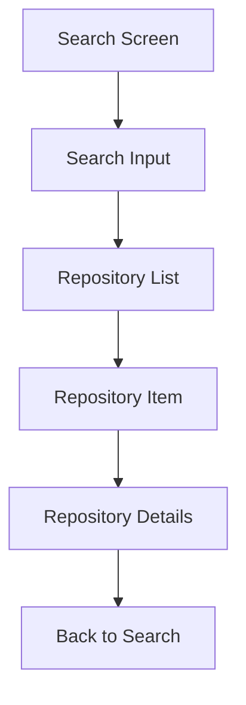
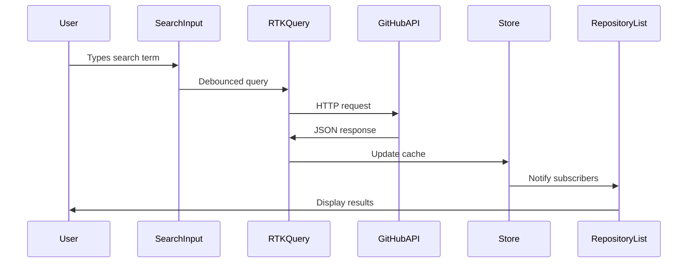
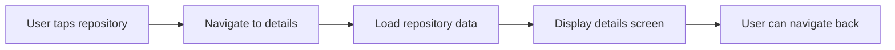
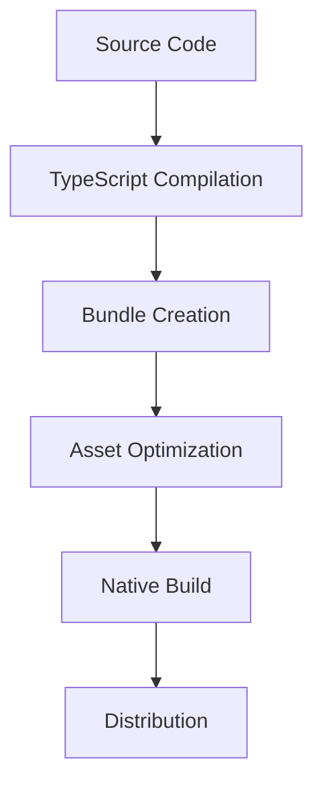

# 🏗️ Architecture Overview

This document outlines the architectural decisions, patterns, and structure of the GitHub Repository Search mobile app.

## 📁 Project Structure

```
src/
├── app/                    # Expo Router pages
│   ├── _layout.tsx        # Root layout with providers
│   ├── index.tsx          # Home/Search screen
│   └── repository/        # Repository detail routes
├── components/            # Reusable UI components
│   ├── error-boundary/    # Error handling components
│   ├── repository-list/   # Repository list & items
│   ├── search-input/      # Search interface
│   └── uni-stack/         # Layout components
├── hooks/                 # Custom React hooks
├── store/                 # Redux store configuration
│   ├── api/              # RTK Query API slices
│   ├── hooks.ts          # Typed Redux hooks
│   └── index.ts          # Store setup
├── theme/                # Design system
├── utils/                # Utility functions
└── mocks/                # Mock data for development
```

## 🏛️ Architectural Patterns

### 1. Component Architecture

#### Atomic Design Principles

- **Atoms**: Basic UI elements (buttons, inputs)
- **Molecules**: Component combinations (search bar, repository item)
- **Organisms**: Complex components (repository list, error boundary)
- **Templates**: Page layouts
- **Pages**: Route components

#### Component Patterns

```tsx
// Example component structure
export interface ComponentProps {
  // Props interface
}

export const Component: React.FC<ComponentProps> = ({ }) => {
  // Component logic
  return (
    // JSX
  );
};
```

### 2. State Management

#### Redux Toolkit Architecture

```
store/
├── index.ts              # Store configuration
├── store-provider.tsx    # React context provider
├── hooks.ts             # Typed useSelector/useDispatch
└── api/
    ├── github-api.ts    # Real API endpoints
    ├── mock-api.ts      # Development mock API
    └── types.ts         # API type definitions
```

#### State Flow

1. **UI Components** dispatch actions
2. **RTK Query** handles API calls and caching
3. **Redux Store** manages global state
4. **React Components** subscribe to state changes

### 3. Navigation Architecture

#### File-based Routing (Expo Router)

```
app/
├── _layout.tsx          # Root layout
├── index.tsx           # Search screen (/)
└── repository/
    └── [id].tsx        # Details screen (/repository/[id])
```

#### Navigation Flow



## 🔧 Core Systems

### 1. API Integration

#### RTK Query Setup

```typescript
export const githubApi = createApi({
  reducerPath: 'githubApi',
  baseQuery: fetchBaseQuery({
    baseUrl: 'https://api.github.com',
    prepareHeaders: (headers) => {
      headers.set('User-Agent', 'RNGitHubRepositorySearch');
      return headers;
    },
  }),
  tagTypes: ['Repository'],
  endpoints: (builder) => ({
    // API endpoints
  }),
});
```

#### Caching Strategy

- **Cache by query**: Search results cached by search term
- **Background updates**: Automatic refetching on focus
- **Infinite scroll**: Pagination handled via cache merging
- **Optimistic updates**: UI updates before API confirmation

### 2. Theme System

#### Design Tokens

```typescript
// Theme structure
export const theme = {
  colors: {
    primary: '#007AFF',
    background: '#FFFFFF',
    surface: '#F2F2F7',
    text: '#000000',
    // ... more colors
  },
  spacing: {
    xs: 4,
    sm: 8,
    md: 16,
    lg: 24,
    xl: 32,
  },
  typography: {
    // Font definitions
  },
};
```

#### Theme Usage

```tsx
// Component with theme
const styles = StyleSheet.create({
  container: {
    backgroundColor: theme.colors.background,
    padding: theme.spacing.md,
  },
});
```

### 3. Error Handling

#### Error Boundary Strategy

```tsx
// Error boundary wrapper
<ErrorBoundary>
  <App />
</ErrorBoundary>
```

#### Error Types

- **Network errors**: API failures, timeouts
- **Parsing errors**: Invalid JSON responses
- **Component errors**: React rendering failures
- **Navigation errors**: Route not found

## 🔄 Data Flow

### Search Flow



### Navigation Flow



## 🎯 Performance Optimizations

### 1. React Optimizations

- **React.memo**: Prevent unnecessary re-renders
- **useMemo/useCallback**: Memoize expensive calculations
- **Lazy loading**: Dynamic imports for large components

### 2. List Performance

- **FlatList**: Virtualized scrolling for large datasets
- **getItemLayout**: Pre-calculated item dimensions
- **keyExtractor**: Stable keys for list items

### 3. Image Optimization

- **Expo Image**: Optimized image component
- **Lazy loading**: Load images as they appear
- **Caching**: Persistent image cache

### 4. Bundle Optimization

- **Code splitting**: Route-based code splitting
- **Tree shaking**: Remove unused code
- **Asset optimization**: Compressed images and fonts

## 🧪 Testing Strategy

### Test Types

1. **Unit Tests**: Individual functions and components
2. **Integration Tests**: Component interactions
3. **E2E Tests**: Full user workflows
4. **API Tests**: Mock and real API responses

### Testing Tools

- **Jest**: Test runner and assertions
- **React Native Testing Library**: Component testing
- **MSW**: API mocking
- **Detox**: E2E testing (future)

## 🚀 Deployment Architecture

### Build Process



### Environment Configuration

- **Development**: Local development with hot reload
- **Preview**: Internal testing builds
- **Production**: App store releases

## 🔮 Future Architecture Considerations

### Scalability

- **Micro-frontends**: Modular app architecture
- **State persistence**: Offline-first approach
- **Background sync**: Data synchronization
- **Push notifications**: Real-time updates

### Performance

- **Code splitting**: Further bundle optimization
- **Concurrent features**: React 18 features
- **Native modules**: Performance-critical operations

### Monitoring

- **Error tracking**: Sentry integration
- **Analytics**: User behavior tracking
- **Performance monitoring**: App performance metrics
